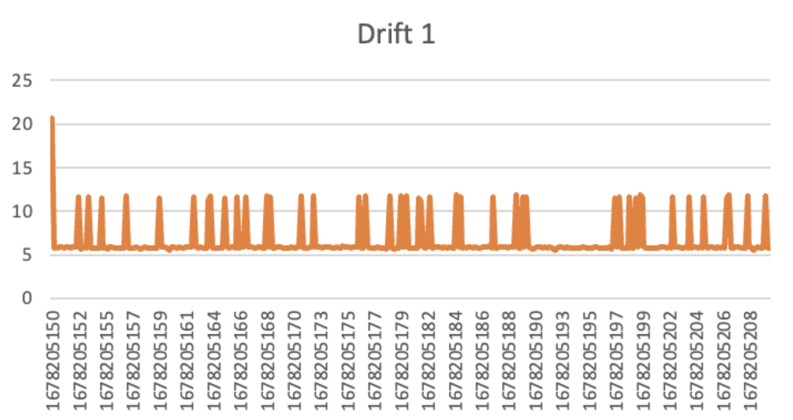
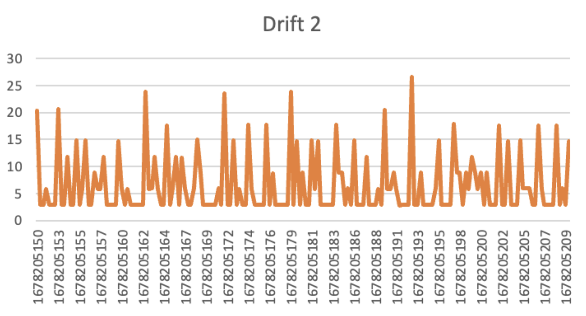

# Scale Models and Logical Clocks
by Siona Prasad and Sayak Maity

## Design Decisions

### Multiprocessing
The main design decision in this code is the use of multiprocessing. We use the multiprocessing module to run each machine in a separate process. This allows each machine to run independently and concurrently with the others.
### Class
Another design decision is the use of the Machine class to represent each machine. The Machine class contains all the necessary methods and attributes to simulate a distributed system. It contains methods to connect machines, send messages, receive messages, handle random events, and log events.

### Logical Clock
The logical clock is an essential component of the distributed system simulation. Each machine has a logical clock, which is updated when a message is sent or received. The logical clock is used to order events in the system.

### Message Queue
Each machine has a message queue, which stores incoming messages. The run method of the Machine class checks the message queue at each iteration of the loop. If there are messages in the queue, the rec_message method is called to process the message. If there are no messages in the queue, the handle_random_event method is called to simulate a random event.
### Random Event
Each machine has a handle_random_event method that simulates a random event. The method generates a random number between 1 and 10. If the number is 1 or 2, the machine sends a message to one of its connections. If the number is 3, the machine sends a message to all of its connections. If the number is greater than 3, the machine generates an internal event.
### Logging
The logging system is another important component of the code. Each machine logs events to a log file and a CSV file. The log file contains a human-readable message that includes the global time, the length of the message queue, the logical clock, and the event message. The CSV file contains the same information, but in a format that can be easily imported into other programs for analysis.
### Cleanup
Before the simulation starts, the code removes any existing log or CSV files in the directory. This is to ensure that the logs are fresh and do not contain old data.
### Conclusion
In conclusion, the main.py file simulates the behavior of multiple machines exchanging messages in a distributed system. The code uses multiprocessing to run each machine in a separate process and a class to represent each machine. Each machine has a logical clock and a message queue. The code simulates random events and logs events to a log file and a CSV file.

## Experiment Results

### Observations
* The size of the jumps in the values for the logical clocks decreases as the clock rate increases
* The drift in values of the local clocks in different machines decreases in standard deviation as the clock rate increases (drift was measured as the standard deviation of the difference in logical clock time divided by the difference in the global clock time at each time/log step)
* If the clock cycles between the machines are closer together, queue values are closer together and average jumps are more similar between machines
* When there is a smaller probability of the event being internal, the average queue length varies more between machines and jump sizes stay similar to the original

[Data Sheet](https://docs.google.com/spreadsheets/d/1tAanilzdFsolDjkegcVqjUamSsm829LlVw85UvUrcJs/edit#gid=898764490)

### System Clock 1: rate 6

### System Clock 2: rate 3
